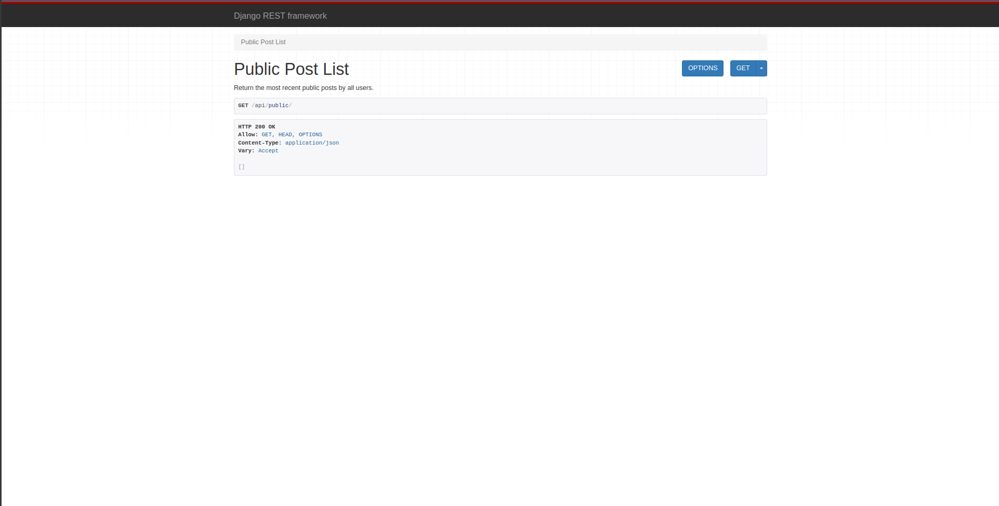

# Project README

## Setting up a Django RESTful API with Django REST Framework

### Steps

1. **Install Django REST Framework**

   - Run the following command to install Django REST Framework:
     ```bash
     pip install djangorestframework
     ```

2. **Update Django Settings**

   - Add 'rest_framework' to your `INSTALLED_APPS` in the `settings.py` file.
   - Configure the `DEFAULT_PERMISSION_CLASSES` in the `REST_FRAMEWORK` settings.

     ```python
     INSTALLED_APPS = [
         'rest_framework',
     ]

     REST_FRAMEWORK = {
         'DEFAULT_PERMISSION_CLASSES': [
             'rest_framework.permissions.AllowAny',
         ],
     }
     ```

3. **Create Serializers**

   - Create a file named `serializers.py` and define the `PostSerializers` class.

     ```python
     from rest_framework import serializers
     from blog import models

     class PostSerializers(serializers.ModelSerializer):
         class Meta:
             model = models.Post
             fields = ("posted_by_id", "message")
     ```

4. **Create API Views**

   - Create a file named `apiviews.py` and define the `PublicPostList` class.

     ```python
     from rest_framework.views import APIView
     from rest_framework.response import Response
     from blog import models
     from .serializers import PostSerializers

     class PublicPostList(APIView):
         def get(self, request):
             msgs = models.Post.objects.public_posts()[:5]
             data = PostSerializers(msgs, many=True).data
             return Response(data)
     ```

5. **Update URLs**

   - Update your `urls.py` to include the API view.

     ```python
     from django.urls import path
     from .apiviews import PublicPostList

     urlpatterns = [
         path("api/public", PublicPostList.as_view(), name="api_public"),
     ]
     ```

6. **Run the Development Server**

   - Run the Django development server and navigate to `http://127.0.0.1:8000/api/public/` to test if your API is working.

### Screenshots

#### Step 7: API Endpoint Result


